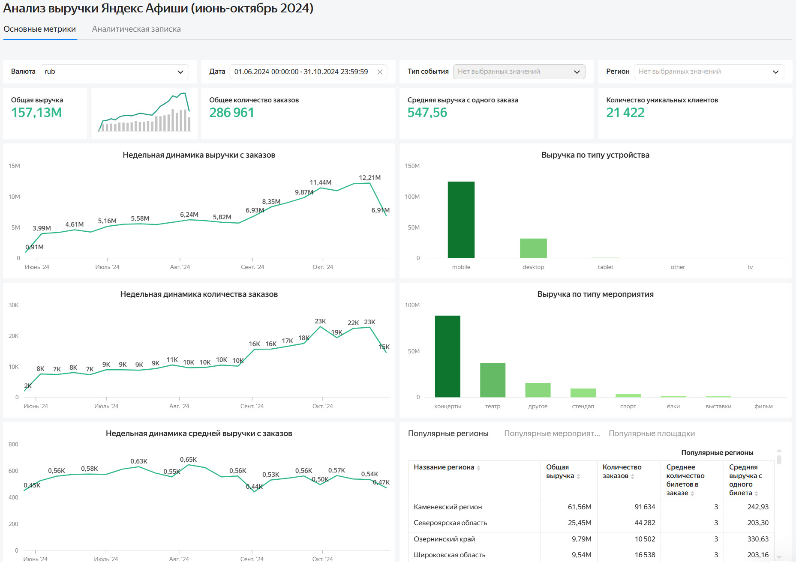

## Анализ пользовательского спроса и продаж сервиса «Яндекс Афиша»

### Быстрый доступ

* [SQL-анализ](Анализ%20данных%20заказов%20с%20помощью%20sql.sql)
* [Исследовательский анализ в Python](Исследовательский%20анализ%20данных%20заказов%20в%20сервисе%20Яндекс%20Афиша.ipynb)
* [Интерактивный дашборд в Yandex DataLens](https://datalens.yandex/d8sfzjjlz810w?_share_link=public)
* [Изображение дашборда](Дашборд.png)

## О проекте

Аналитический проект по исследованию заказов билетов в сервисе «Яндекс Афиша» за период с июня по октябрь 2024 года.

В рамках проекта исследованы динамика заказов и выручки, структура спроса по типам мероприятий и устройствам, пользовательская активность, а также различия в поведении пользователей мобильных и desktop-устройств.

### Цель проекта

Проанализировать динамику продаж и пользовательского спроса, выявить изменения в структуре заказов и выручки и определить показатели, которые могут быть полезны для оценки работы сервиса.

### Данные

В проекте использовались данные о:

* заказах билетов;
* мероприятиях;
* билетных операторах;
* площадках;
* городах и регионах;
* курсах валют.

**Период данных:** 1 июня - 31 октября 2024 года.

В исходной таблице заказов - **290 849 заказов**.

Исходные данные предоставлены в рамках учебного проекта Yandex Practicum и не публикуются в репозитории.

### Этапы проекта

#### 1. Анализ данных с помощью SQL

В SQL проведены:

* изучение структуры базы данных и связей между таблицами;
* проверка качества данных;
* проверка уникальности идентификаторов и наличия пропусков;
* анализ категориальных и количественных показателей;
* проверка значений выручки;
* расчёт ключевых метрик;
* анализ динамики заказов и выручки;
* анализ мероприятий, регионов и площадок;
* подготовка показателей для дашборда.

SQL-анализ выполнен на исходных данных.

**Файл:** [`Анализ данных заказов с помощью sql.sql`](Анализ%20данных%20заказов%20с%20помощью%20sql.sql)

#### 2. Дашборд в Yandex DataLens

На основе результатов SQL-анализа создан интерактивный дашборд для анализа ключевых показателей и структуры продаж.

На дашборде представлены:

* общая выручка;
* количество заказов;
* средняя выручка с заказа;
* количество уникальных покупателей;
* динамика ключевых показателей;
* структура выручки по типам мероприятий;
* структура выручки по типам устройств;
* популярные регионы, события и площадки.

Доступна фильтрация данных по валюте, периоду, типу мероприятия и региону.

**[Открыть интерактивный дашборд в Yandex DataLens](https://datalens.yandex/d8sfzjjlz810w?_share_link=public)**

#### 3. Исследовательский анализ в Python

В Python проведены:

* дополнительная проверка и подготовка данных;
* анализ пропусков и категориальных значений;
* обработка экстремальных значений выручки;
* проверка явных и неявных дубликатов;
* приведение выручки к единой валюте;
* расчёт дополнительных показателей;
* анализ динамики заказов;
* сравнение летнего и осеннего периодов;
* анализ пользовательской активности осенью;
* исследование типов мероприятий, регионов и билетных партнёров;
* статистическая проверка различий между mobile- и desktop-пользователями с помощью одностороннего Welch t-test.

В результате предобработки сформирован очищенный набор данных из **287 923 наблюдений**.

**Файл:** [`Исследовательский анализ данных заказов в сервисе Яндекс Афиша.ipynb`](Исследовательский%20анализ%20данных%20заказов%20в%20сервисе%20Яндекс%20Афиша.ipynb)

### Основные результаты

* Количество заказов увеличивалось от июня к октябрю; наиболее высокий объём заказов наблюдался в октябре.
* В структуре заказов преобладали мобильные устройства.
* При сравнении летнего и осеннего периодов изменилась структура спроса по типам мероприятий: увеличились доли театральных и спортивных мероприятий, а доля концертов снизилась.
* В осеннем периоде около **76% заказов приходилось на будние дни**, около **24% — на выходные**.
* Средняя выручка в расчёте на один билет различалась между типами мероприятий и менялась между летним и осенним периодами.
* В ходе предобработки были обработаны экстремальные значения выручки и неявные дубликаты. Отрицательные значения выручки сохранены, поскольку в данных отсутствует отдельный признак возврата, позволяющий однозначно определить их причину.
* После предобработки для исследовательского анализа осталось **287 923 наблюдения**.
* Статистический анализ выявил статистически значимые различия между mobile- и desktop-пользователями по среднему количеству заказов на пользователя и среднему интервалу между заказами. Подробные результаты и параметры тестов представлены в Jupyter Notebook.

### Инструменты

* **SQL**
* **PostgreSQL**
* **DBeaver**
* **Python**
* **Pandas**
* **Matplotlib**
* **Seaborn**
* **SciPy**
* **Jupyter Notebook**
* **Yandex DataLens**
